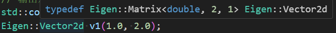
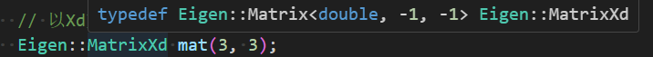

# 用到的参考链接
`<官方文档>` : <http://eigen.tuxfamily.org/dox/GettingStarted.html>

`<中文教程>` : <https://github.com/qixianyu-buaa/EigenChineseDocument>

`<博客教程>` : <http://zhaoxuhui.top/blog/2019/08/21/eigen-note-1.html>

本学习过程采用camke，本人是cmake三脚猫使用者。
# 1. Eigen的安装(Linux22.04)
```
sudo apt install libeigen3-dev
# 查看位置
whereis eigen3
```
MARK: 本人使用的是Ubuntu22.04，安装完成后，可以在/usr/include/eigen3中看到头文件。apt是更方便的安装命令，apt-get也可以安装。现在大家建议使用apt
# 2. Eigen的使用
## 2.1 cmake入门
强烈建议看[B站小彭老师入门视频](https://space.bilibili.com/263032155/channel/collectiondetail?sid=53025)
```
# 首先是cmake的版本
cmake_minimum_required(VERSION 3.22)
# 指定项目和语言
project(EigenUse CXX)
# 指定编译标准
set(CMAKE_CXX_STANDARD 17)

# 查找Eigen3，找到一般会创建一些变量，例如下面的“EIGEN3_INCLUDE_DIR”，还有一个常用的<LibaryName>_FOUND检测是否找到
find_package(Eigen3 REQUIRED)
# 添加头文件
include_directories(${EIGEN3_INCLUDE_DIR})

# 设置可执行文件输出路径
set(EXECUTABLE_OUTPUT_PATH ${PROJECT_SOURCE_DIR}/bin)

# 输出一些信息，一般有三种状态：STATUS、WARNING、FATAL_ERROR
message(STATUS "Eigen3 include dir: ${EIGEN3_INCLUDE_DIR}")

# 添加可执行文件，可添加多个
add_executable(eigenVersion eigenVersion.cpp)
# 添加可执行文件program_day_num
add_executable(program_1_1 main.cpp)
```
注意Eigen是纯头文件引入，其实不用find_package也行
```
set(EIGEN3_INCLUDE_DIR /usr/include/eigen3)
include_directories(${EIGEN3_INCLUDE_DIR})
```
# 阅读源码，同时也学习c++
## MatrixBase.h
首先是一个模板类`MatrixBase`的定义，它继承`DenseBase`类。`MatrixBase`类是Eigen中矩阵和向量类的基类，它提供了一些基本的矩阵和向量操作，如行列数、元素访问、赋值、加减乘除等。这个类中定义了一些类型别名，如`StorageBaseType`、`StorageKind`、`StorageIndex`、`Scalar`、`PacketScalar`和`RealScalar`等，它们分别表示矩阵的存储类型、存储方式、索引类型、元素类型、数据包类型和实数类型等。此外，这个类还定义了一些成员函数和成员变量，如`rows()`、`cols()`、`coeff()`、`coeffRef()`、`lazyAssign()`、`eval()`等，它们分别表示矩阵的行数、列数、元素值、元素引用、延迟赋值和求值等。这个类还定义了一些类型别名，如`CoeffReturnType`、`ConstTransposeReturnType`、`RowXpr`和`ColXpr`等，它们分别表示矩阵的系数返回类型、常量转置返回类型、行表达式和列表达式等。
`typedef typename ...` 是一种常见的C++语法，它用于定义类型别名。在模板类中，有些类型可能依赖于模板参数，因此需要使用`typename`关键字来告诉编译器某个名称是一个类型。例如，在这段代码中，`typename internal::traits<Derived>::Scalar`表示`Derived`类型的标量类型，`typename internal::packet_traits<Scalar>::type`表示标量类型的数据包类型。由于这些类型依赖于模板参数`Derived`和`Scalar`，因此需要使用`typename`关键字来告诉编译器这些名称是类型而不是变量或函数。
`using`是C++11引入的一种新特性，用于定义类型别名、继承基类的成员、导入命名空间中的成员等。在`Eigen`中，`Base`基类定义在`DenseBase`类中。`DenseBase`类是`Eigen`中矩阵和向量类的基类，它提供了一些基本的矩阵和向量操作，如行列数、元素访问、赋值、加减乘除等。MatrixBase类是DenseBase类的派生类，它进一步扩展了矩阵和向量的操作，如转置、共轭、逆、行列式、特征值等。`MatrixBase`类中定义了一些类型别名、成员函数和成员变量，用于表示矩阵和向量的属性和操作。由于`MatrixBase`类继承自`DenseBase`类，因此可以使用`Base::`来访问`DenseBase`类中的成员
<font color=red>Mark:</font> `\sa`表示"see also"，用于引用相关的函数或类。例如，在这段代码中，`\sa rows()`表示参见`rows()`函数，可以在文档中直接跳转到`rows()`函数的定义处。`\internal`表示"internal use only"，用于标记某个成员或函数是仅供内部使用的。这些成员或函数通常不应该被外部用户直接调用，而是由其他成员或函数调用。在文档中，`\internal`标记的成员或函数通常不会被列出，只有在内部文档中才会显示。还有其他一些类似的注释标记，例如`\brief`表示函数或类的简要说明，`\param`表示函数参数的说明，`\return`表示函数返回值的说明等。这些标记可以帮助文档生成器自动生成文档，并提高文档的可读性和准确性。

# Matrix
首先我们注意到一个点就是，鼠标查看Vector2d、Vector3d、Matrix3d等类的定义,可以发现他们都是Matrix的别名，Eigen库中矩阵为其基本数据类型，向量也是一种特殊的矩阵。其所有矩阵数据类型都是由一个模板类Matrix生成。


> 如果是动态大小的矩阵，参数会变成-1，-1,也是Dynamic关键字的含义。没有使用Eigen命名空间，要用Eigen::Dynamic才能识别。
----
简单来说基本上所有的变量创建都可以由Matrix来完成。
```
// 完整的参数列表
<typename _Scalar, int _Rows, int _Cols, int _Options = AutoAlign | ( ( _Rows == 1 && _Cols != 1 ) ? Eigen :: RowMajor : ( _Cols == 1 && _Rows != 1 ) ? Eigen :: ColMajor : Eigen :: ColMajor ), int _MaxRows = _Rows, int _MaxCols = _Cols> Matrix
// 前三个必须设置，后三个可选，是行主序还是列主序，行列最大值等等。
    Eigen::Matrix<typename Scalar, int RowsAtCompileTime, int ColsAtCompileTime>  mat1;
// Scalar是数据类型，有double、int、float等等，后面是矩阵大小。创建时不初始化，矩阵元素默认是 0 ；别名都是为了方便才起的，对于项目而言使用Matrix更直观。
```
- 加法：只能用于相同大小矩阵
- 减法：只能用于相同大小矩阵
- 乘法：矩阵与标量、矩阵与矩阵
- 除法：只能用于矩阵与标量
----
矩阵本身的操作
- mat.transpose()：转置矩阵。对于矩阵转置，注意不要写成a = a.transpose()，这会导致错误结果(Aliasing Issue)，如果一定需要对原矩阵进行修改，使用a.transposeInPlace()函数。
- mat.inverse()：逆矩阵
- mat.conjugate()：共轭矩阵
- mat.adjoint()：伴随矩阵
- mat.trace()：矩阵的迹
- mat.eigenvalues()：矩阵的特征值
- mat.determinant()：矩阵求行列式的值
- mat.diagonal()：矩阵对角线元素
- mat.sum()：矩阵所有元素求和
- mat.prod()：矩阵所有元素求积
- mat.mean()：矩阵所有元素求平均
- mat.minCoeff()：矩阵所有元素最小值
- mat.minCoeff(&i,&j)：矩阵所有元素最小值的位置，i、j为int类型或为Eigen的Index类型。
- mat.maxCoeff()：矩阵所有元素最大值
- mat.maxCoeff(&i,&j)：矩阵所有元素最大值的位置
- mat.nonZeros()：矩阵中非零元素个数
- mat.squaredNorm()：矩阵(向量)的平方范数，对向量而言等价于其与自身做点积，数值上等于各分量的平方和。
- mat.norm()：矩阵(向量)的平方范数开根号(对于向量即求模长)
- mat.lpNorm<1>()：矩阵(向量)的L1范数
- mat.lpNorm<2>()：矩阵(向量)的L2范数
- mat.lpNorm<Infinity>()：矩阵(向量)的L无穷范数
- mat.lpNorm&lt;p&gt; ()：矩阵(向量)的Lp范数
- mat.normalize()：矩阵(向量)的正则化(归一化)，使所有元素的平方和等于1。
- (mat>0).all()：矩阵元素条件判断，mat中所有元素是否都大于0，是返回1，否则返回0。
- (mat>0).any()：矩阵元素条件判断，mat中所有元素是否有大于0的，有返回1，否则返回0。
- (mat>0).count()：矩阵符合条件的元素计数，返回mat中大于0元素的个数。
- mat.colwise()：返回矩阵每列的值
- mat.rowwise()：返回矩阵每行的值

# Array
Array 类似matlab中的对应元素相乘，相加等等，是对每个元素或者对应位置的元素之间进行操作。
Array 类是 Eigen 中用于表示数组的类，它的功能与 Matrix 类相似，Array在元素级运算上有着强大的优势，其本身也可以与Matrix相互转换，也十分简单。将Matrix转换为Array函数为mat.array()，将Array转换为Matrix函数为arr.matrix()，这样的转换不用担心会有运行时性能的损耗。但需要注意的是Eigen是不允许Matrix和Array混合运算的。
事实上，由于元素级运算在矩阵中很常见，所以Eigen对于Matrix其实内置了一些函数，均以cwise开头，如`mat.cwiseProduct()`对应元素相乘、`mat.cwiseAbs()`元素取绝对值、`mat.cwiseSqrt()`逐元素开根号、`mat.cwiseMin()`将两个矩阵中相应位置的最小值组成一个新矩阵等等。